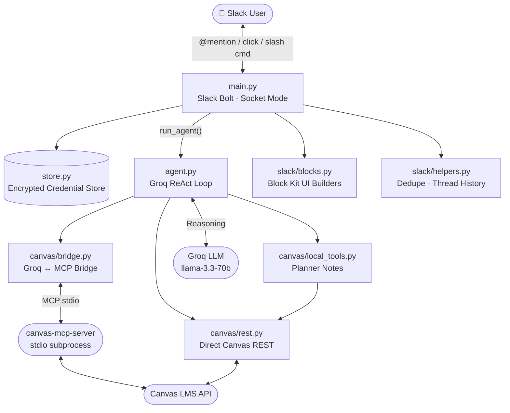
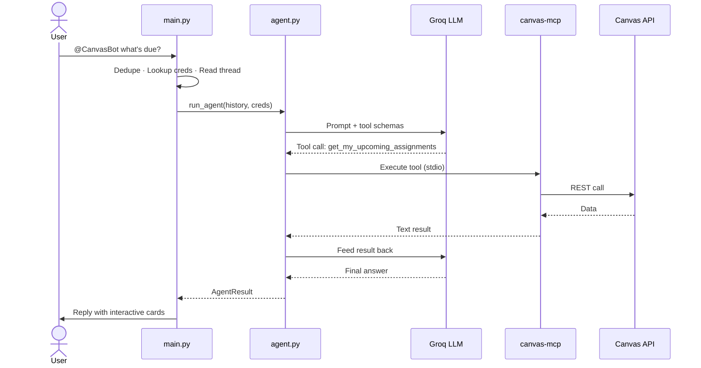

# Canvas Slack Agent — Architecture

```mermaid
flowchart TD
    User(["👤 Slack User"])

    User <-->|"@mention / click / slash cmd"| Main

    Main["main.py<br/>Slack Bolt · Socket Mode"]
    Store[("store.py<br/>Encrypted Credential Store")]
    Agent["agent.py<br/>Groq ReAct Loop"]
    Blocks["slack/blocks.py<br/>Block Kit UI Builders"]
    Helpers["slack/helpers.py<br/>Dedupe · Thread History"]

    Bridge["canvas/bridge.py<br/>Groq ↔ MCP Bridge"]
    Rest["canvas/rest.py<br/>Direct Canvas REST"]
    LocalTools["canvas/local_tools.py<br/>Planner Notes"]

    Groq(["Groq LLM<br/>llama-3.3-70b"])
    MCP(["canvas-mcp-server<br/>stdio subprocess"])
    Canvas(["Canvas LMS API"])

    Main --> Store
    Main --> Helpers
    Main --> Blocks
    Main -->|"run_agent()"| Agent

    Agent <-->|"Reasoning"| Groq
    Agent --> Bridge
    Agent --> LocalTools
    Agent --> Rest

    Bridge <-->|"MCP stdio"| MCP
    MCP <--> Canvas
    Rest <--> Canvas
    LocalTools --> Rest
```

## Request Flow

```mermaid
sequenceDiagram
    actor User
    participant Slack as main.py
    participant Agent as agent.py
    participant Groq as Groq LLM
    participant MCP as canvas-mcp
    participant Canvas as Canvas API

    User->>Slack: @CanvasBot what's due?
    Slack->>Slack: Dedupe · Lookup creds · Read thread
    Slack->>Agent: run_agent(history, creds)
    Agent->>Groq: Prompt + tool schemas
    Groq-->>Agent: Tool call: get_my_upcoming_assignments
    Agent->>MCP: Execute tool (stdio)
    MCP->>Canvas: REST call
    Canvas-->>MCP: Data
    MCP-->>Agent: Text result
    Agent->>Groq: Feed result back
    Groq-->>Agent: Final answer
    Agent-->>Slack: AgentResult
    Slack->>User: Reply with interactive cards
```
