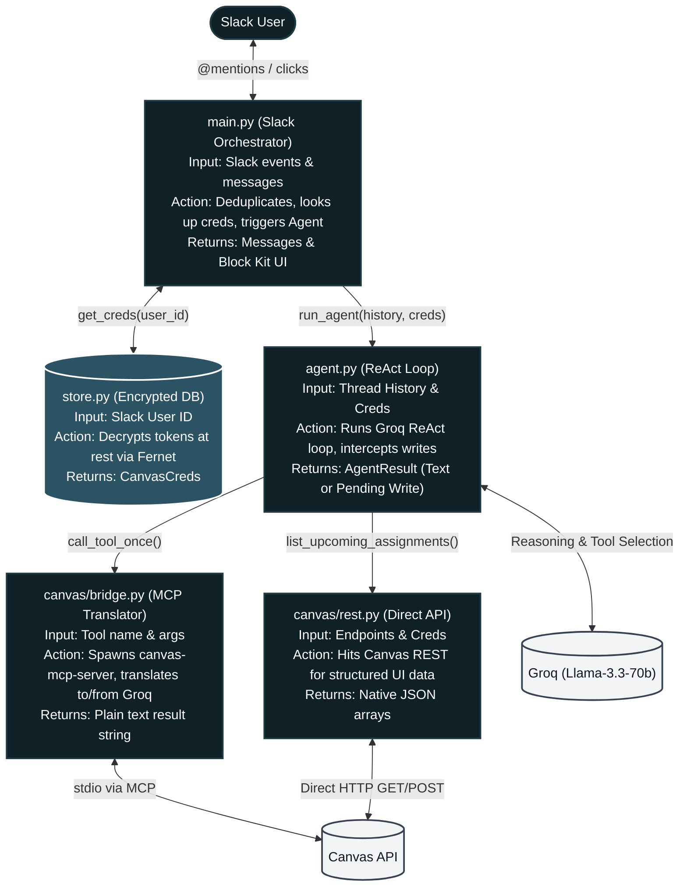
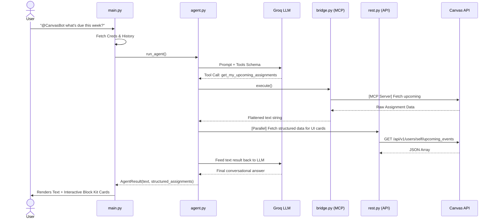
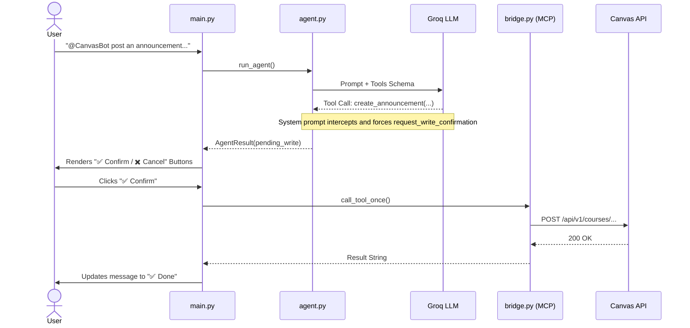

# Slack Canvas Agent Architecture

```mermaid
flowchart TD
    %% Node Definitions with Quotes to prevent parse errors
    User(["Slack User"])
    
    Main["main.py (Slack Orchestrator)\nInput: Slack events & messages\nAction: Deduplicates, looks up creds, triggers Agent\nReturns: Messages & Block Kit UI"]
    
    Store[("store.py (Encrypted DB)\nInput: Slack User ID\nAction: Decrypts tokens at rest via Fernet\nReturns: CanvasCreds")]
    
    Agent["agent.py (ReAct Loop)\nInput: Thread History & Creds\nAction: Runs Groq ReAct loop, intercepts writes\nReturns: AgentResult (Text or Pending Write)"]
    
    Bridge["canvas/bridge.py (MCP Translator)\nInput: Tool name & args\nAction: Spawns canvas-mcp-server, translates to/from Groq\nReturns: Plain text result string"]
    
    Rest["canvas/rest.py (Direct API)\nInput: Endpoints & Creds\nAction: Hits Canvas REST for structured UI data\nReturns: Native JSON arrays"]
    
    Groq[("Groq (Llama-3.3-70b)")]
    Canvas[("Canvas API")]

    %% Connections
    User <-->|"@mentions / clicks"| Main
    Main <-->|"get_creds(user_id)"| Store
    Main -->|"run_agent(history, creds)"| Agent
    Agent <-->|"Reasoning & Tool Selection"| Groq
    Agent -->|"call_tool_once()"| Bridge
    Agent -->|"list_upcoming_assignments()"| Rest
    Bridge <-->|"stdio via MCP"| Canvas
    Rest <-->|"Direct HTTP GET/POST"| Canvas

    %% Styling
    classDef ext fill:#F3F4F6,stroke:#374151,stroke-width:2px,color:#111827;
    classDef core fill:#0F2027,stroke:#203A43,stroke-width:2px,color:#fff;
    classDef data fill:#2C5364,stroke:#fff,stroke-width:2px,color:#fff;
    
    User:::core
    Main:::core
    Agent:::core
    Bridge:::core
    Rest:::core
    Store:::data
    Groq:::ext
    Canvas:::ext
```

### Read Flow Example: "What's due this week?"

```mermaid
sequenceDiagram
    actor User
    participant Slack as main.py
    participant Agent as agent.py
    participant Groq as Groq LLM
    participant Bridge as bridge.py (MCP)
    participant Rest as rest.py (API)
    participant Canvas as Canvas API

    User->>Slack: "@CanvasBot what's due this week?"
    Slack->>Slack: Fetch Creds & History
    Slack->>Agent: run_agent()
    Agent->>Groq: Prompt + Tools Schema
    Groq-->>Agent: Tool Call: get_my_upcoming_assignments
    Agent->>Bridge: execute()
    Bridge->>Canvas: [MCP Server] Fetch upcoming
    Canvas-->>Bridge: Raw Assignment Data
    Bridge-->>Agent: Flattened text string
    Agent->>Rest: [Parallel] Fetch structured data for UI cards
    Rest->>Canvas: GET /api/v1/users/self/upcoming_events
    Canvas-->>Rest: JSON Array
    Agent->>Groq: Feed text result back to LLM
    Groq-->>Agent: Final conversational answer
    Agent-->>Slack: AgentResult(text, structured_assignments)
    Slack->>User: Renders Text + Interactive Block Kit Cards
```

### Write Flow Example: "Post an announcement"

```mermaid
sequenceDiagram
    actor User
    participant Slack as main.py
    participant Agent as agent.py
    participant Groq as Groq LLM
    participant Bridge as bridge.py (MCP)
    participant Canvas as Canvas API

    User->>Slack: "@CanvasBot post an announcement..."
    Slack->>Agent: run_agent()
    
    Agent->>Groq: Prompt + Tools Schema
    Groq-->>Agent: Tool Call: create_announcement(...)
    Note over Agent,Groq: System prompt intercepts and forces request_write_confirmation
    Agent-->>Slack: AgentResult(pending_write)
    
    Slack->>User: Renders "✅ Confirm / ✖️ Cancel" Buttons
    User->>Slack: Clicks "✅ Confirm"
    Slack->>Bridge: call_tool_once()
    Bridge->>Canvas: POST /api/v1/courses/...
    Canvas-->>Bridge: 200 OK
    Bridge-->>Slack: Result String
    Slack->>User: Updates message to "✅ Done"
```
